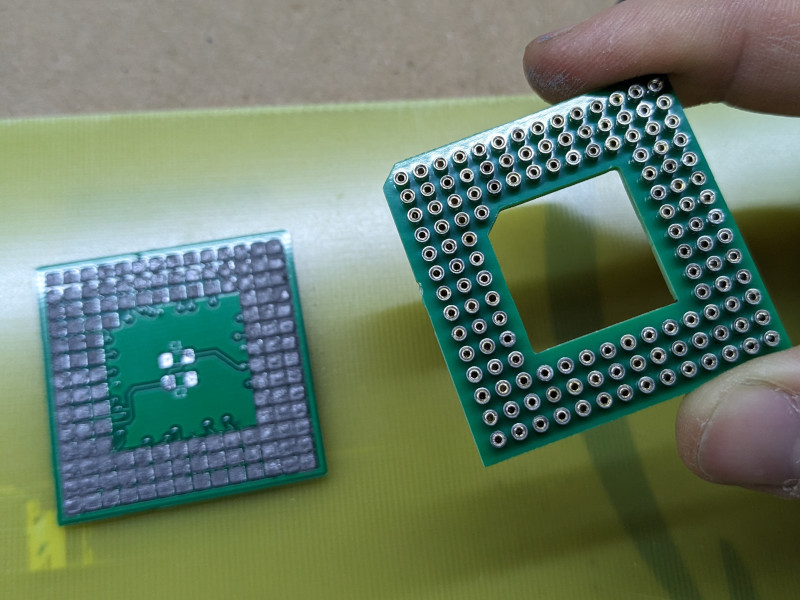

# 386DX QFP -> PGA Adapter

## Introduction

386DX CPUs in ceramic PGA packages are getting rarer and more expensive by the day, while QFP variants can still be found relatively easily. But some motherboards don't have a space for a QFP CPU, and they're an hassle to swap anyway.

This project provides a way to adapt the QFP variants of the 386DX cpus to a PGA format, by using commonly available hardware parts.
I tested the procedure on an AM386DX @ 40Mhz, and the machine happily ran memory tests and benchmarks for hours.

### Disclaimer

I take NO responsibility for what happens if you decide to build and use this adapter. But You're encourauged to take what you deem fit from this, and use it in your projects!

## Required components

* The PCB adapter itself, 1.6mm thickness is fine
* The pin holder, 1.6mm thickness
* Stencil for the bottom (PGA) side of the adapter
* Solder paste for SMD work
* Pin sockets, lots of (>132, as some will be bent, out of spec, etc.). 7.54mm for height is a good measure. You can find them on Aliexpress, e.g. [here](https://www.aliexpress.com/item/1005003484780787.html).

### How to build

1. Place the pin holder somewhere raised that leaves you access to the pin holes. I use a "helping hand" soldering tool that pinches the holder at the corners and leaves free the top and bottom of it.
2. Install all the pins from the top. They don't have to snap. It is sufficient that they slide into every hole and stay flush on top. Make sure the height is the same for every pin.
3. Put the QFP-PGA adapter PCB on a flat surface, PGA side (the one with all the "squares") on top.
4. Using the stencil, apply the solder paste evenly on every square where the pins are going to go
5. Carefully lift the adapter PCB, flip it, and put the PGA side on top of the holder with pins (the one currently mounted on the helping hand), making sure that the edges of both PCBs are aligned. You'll get a sandwich of the adapter and holder with the "heads" of the pin in between.
6. Release the holder from the helping hand and flip both the holder and the adapter PCB together, and place them on a flat, heat resistant surface (I use vetronite), with pins pointing towards the ceiling.
7. Turn on your hot air soldering station, and slowly begin soldering all the pins, first heating everything then working on all the sides of the adapter, trying to blow directly on the pins.
8. Pins will start to move slightly, as the flux evaporates. Keep circling around. When they stop moving, they'll have sucked up most of the solder.
9. Wait for everything to cool down, then carefully remove the holder.
10. Inspect with a good light and magnifying glass for shorts between pins. Usually the pins will suck up the excess solder, and you'll probably find no shorts at all. Cut the shorts you find, being careful not to damage the adapter. Also, check that every pin is attached correctly.
11. If you see that some pin has not attached correctly, or is a bit raised than the rest, apply flux, holder, and re-heat.
12. Install the bypass caps if you want them.
13. Reinstall the holder for structural stability. It doesn't have to snap in. It'll hold on pretty well anyway.
14. You can now solder the processor on the completed adapter. Use a soldering iron for this.

Here are some pics at various points of the procedure. Some images refer to a V53 adapter, but the procedure is identical to the one for this CPU.

## Notes

The last tested revision of the board is Rev.1, changes to Rev.3 are minimal and mostly aesthetic, but be warned.

I tested this adapter with an AM386DX @ 40Mhz.

